# 🧭 Overview – Workstation Setup

This document provides a high-level architectural summary of the `workstation-setup` project. It explains the cross-platform bootstrap strategy, tool configuration flow, and how operating system detection and dispatch logic work.

---

## 📌 Purpose

To automate bootstrapping of a development environment on macOS, Linux, or Windows with a single command. The goal is modular, idempotent, and secure configuration of tools, shells, dotfiles, and packages.

---

## 🧱 System Architecture

```mermaid
flowchart TD
    Start([🖥️ Fresh Machine]) --> Bootstrap["./bootstrap"]
    Bootstrap --> OSDetect{OS?}

    OSDetect -->|macOS/Linux| SetupSH["scripts/setup.sh"]
    OSDetect -->|Windows| SetupPS["scripts/setup.ps1"]

    subgraph Unix
        SetupSH --> Brew["Install Homebrew"]
        Brew --> CoreTools
        CoreTools --> ShellConfig["Setup zsh + dotfiles"]
        ShellConfig --> LangManagers["Install pyenv, nvm"]
        LangManagers --> IDE["Install VS Code"]
        IDE --> DoneSH([✅ Ready])
    end

    subgraph Win
        SetupPS --> Choco["Install Chocolatey"]
        Choco --> WSLCheck{WSL needed?}
        WSLCheck -->|Yes| WSL["Install WSL"]
        WSLCheck -->|No| SkipWSL["Skip"]
        WSL --> PSProfile
        SkipWSL --> PSProfile
        PSProfile["PowerShell profile + dotfiles"] --> WinTools["Install dev tools"]
        WinTools --> DonePS([✅ Ready])
    end

    DoneSH --> End([🎉 Dev Box Ready])
    DonePS --> End
```



---

## 🧠 OS Detection Logic

The `bootstrap` script is polyglot: it runs in both PowerShell and Bash. Here's how it routes execution:

### Bash Block

```bash
os_name="$(uname -s)"
case "$os_name" in
  Linux)
    exec bash ./scripts/setup.sh
    ;;
  Darwin)
    exec bash ./scripts/setup.sh
    ;;
  *)
    echo "Unsupported OS: $os_name"
    exit 1
    ;;
esac
```

### PowerShell Block

```powershell
Write-Host "Detected Windows"
.\scripts\setup.ps1
```

This logic is embedded within a single `bootstrap` file using multiline heredoc-style PowerShell comments.

---

## 🧰 Config Flow

1. **Read user config:** `configs/dev_env.yml`
2. **Determine tools to install**
3. **Check for existing installs**
4. **Install only what’s missing**
5. **Link/patch dotfiles into shell envs**
6. **Log output and errors to `logs/`**
7. **Run validation smoke test**

---

## ⚙️ Tool Configuration Strategy

| Component     | Setup Path                 | Config Source            |
| ------------- | -------------------------- | ------------------------ |
| Shell         | `.bashrc` / `.zshrc`       | `configs/`, `dotfiles/`  |
| Git           | `.gitconfig`               | `configs/`               |
| Python        | `pyenv`, `.python-version` | `configs/dev_env.yml`    |
| Node.js       | `nvm`, `.nvmrc`            | `configs/dev_env.yml`    |
| Editor        | VS Code (`settings.json`)  | `configs/` or downloaded |
| Secrets (opt) | `1password` CLI            | Environment + `op run`   |

---

## 🔁 Idempotency Safeguards

* All tools check for existence before installing
* Dotfiles are backed up if present
* Config values are appended, not overwritten
* Re-running scripts will never break an existing setup

---

## 📂 Key Files

* `bootstrap` → cross-platform entrypoint
* `setup.sh` / `setup.ps1` → platform logic
* `configs/dev_env.yml` → user config
* `dotfiles/` → shell/editor environment
* `logs/setup.log` / `error.log` → trace output
* `tests/` → smoke test coverage

---

## ✅ Outcome

By the end of execution, the user will have a working dev environment tailored to their preferences—on any OS—with validated installs, synced dotfiles, and reusable config logic.
